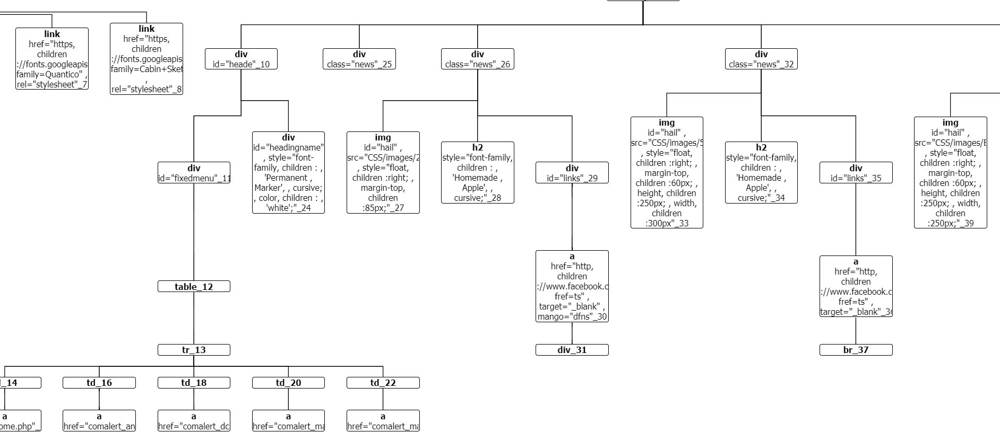

# HTML-Parser
A HTML parser to convert a html file into it's Document Object Model tree represented in JSON form. The JSON format can be visualised using the treant.js library. Also provided with a check for tags that have not been closed.

The parser warns the user if an attribute placed in a tag is not one that is allowed

